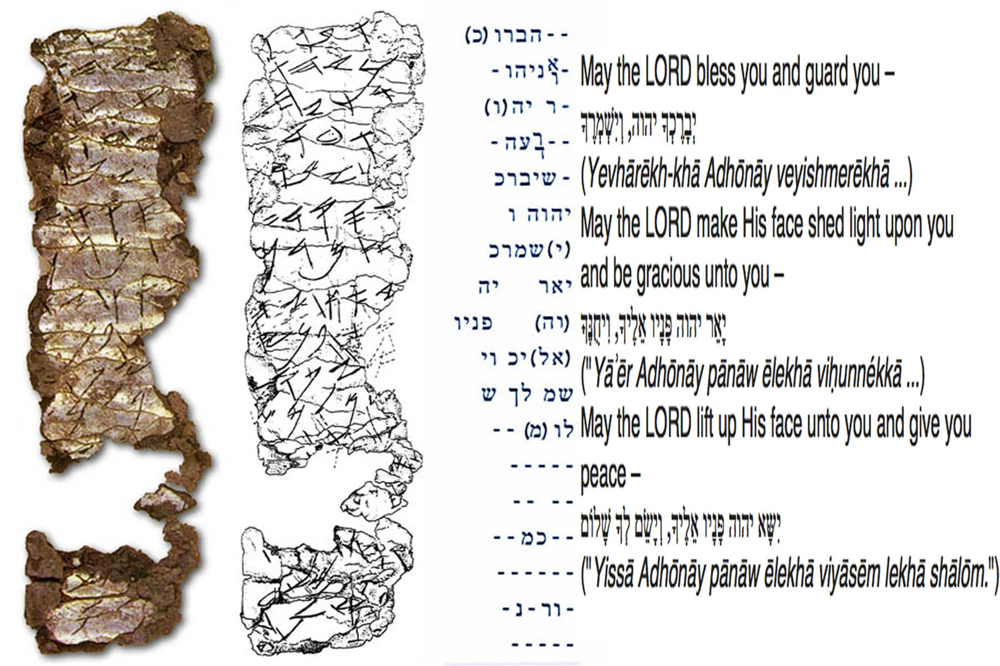
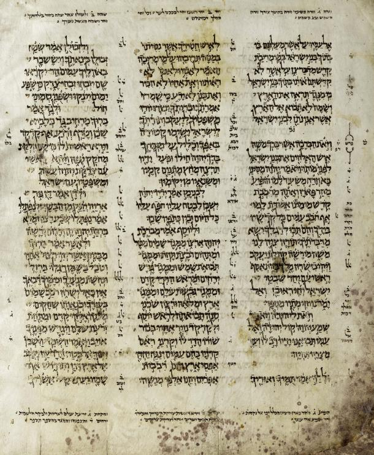

# Einführung in die 
### Religionswissenschaft
{: .r-fit-text}

### Wie werden heilige Schriften überliefert?

Wintersemester 2025/2026
Prof. Dr. Nathan Gibson

## 📈 Rückblick: Lernziel

Erklären können, wie Normativitätsansprüche in der Religionswissenschaft untersucht werden können.

## 📈 Rückblick: Normen

- Aktivität: Schere, Stein, Papier (Spielregeln, Verletzungen, Interpretationen, Werte)
- Normativität: vorschreibend anstatt beschreibend
- Normen = "Regeln für beobachtbares Verhalten" (Schlieter 2012, 228), konkrete Erwartungen von Gruppen (nicht nur individuelle Werten, nicht unbedingt kodifiziert)

## 📈 Rückblick: Normen

- Funktionen: erwünschte Handlungen bilden, Leute ein- oder ausschließen

## 📈 Rückblick: Normverletzungen

Normverletzungen können zu Schuldbekenntnis, Legitimierungsversuch, Sanktionen, Präzisierung, Verlust an Legitimität führen.

## 📈 Rückblick: Religiöse Normen

- Ob sie gesellschaftliche Erwartungen aufbewahren und sakralisieren oder bestehende Normen verwerfen? 
- Legitimierung für Normen, z. B. in sakralen Texten (Kodifizierung)
- dazu werden Interpretationsregeln gebraucht
- aus innerer Perspektive geht es um "Orthodoxie" und "Heterodoxie" bzw. "Häresie/Ketzerei"

## Projekte

- Heilige Schriften modern übermittelt
- YouVersion Bibel-App
- Wie funktioniert Jüdisches Gesetz 

## Einleitung

(in Kleingruppen:) Würden Sie folgendes sagen oder schreiben?

- Geburtstagswünsche
- Heiratsantrag
- Einkaufsliste
- Terminvereinbarung mit Freunden für den Weihnachtsmarkt
- Terminvereinbarung mit Arzt/in für eine OP
- Gesetzesentwurf

## Einleitung

- Wann oder wofür schreiben Sie etwas auf? 
- Wann entscheiden Sie sich für mündliche Formate? 
- Welche Kraft hat die Schrift?
- Welche Kraft hat das gesprochene Wort? 

## Heutiges Lernziel

Die mündliche und schriftliche Dynamik der abrahamitischen Religionen im Verhältnis zueinander zu beschreiben.

## Thora

- Offenbarung in den abrahamitischen Religionen
- Schrift als Privileg
- Schrift als Kraft

<!-- 
- writing materials
- songs whose words you don't understand
- write different kind of messages (vowels, direction, spelling, etc.), plant them around classroom and have them distribute
- Live long and prosper blessing - sign of written letter, oral blessing.
- power of spoken vs. oral word. Ten commandments, plastered stone, silver scroll, numerology. And after all oldest writings are receipts.
- why write something down if most people can't read it?
- how to pronounce name of letters (Z)
- Pelikan
  - Qore vs. Ktiv
  - translation: oral vs. written
  - translation > commentary
 -->

## Welche Technologie sieht Ihr hier im Raum?

<!-- book as technology. Binding, ink, paper, format of writing, alphabet. -->

## Thora

<figcaption>https://www.publicdomainpictures.net/en/view-image.php?image=335404&picture=pergamino-de-plata-ketef-hinnom, CC0/Public domain.</figcaption>

## Lektüre: Zusammenfassung

- 69-70 Methoden von Auslegung sind in verschiedenen jüdischen Texten/Genres erhalten
- 70-72 Apokryphen: jüdische Schriften von der Zeit der Zweiten Tempels, die nur in der griechischen Version erhalten sind

## Aktivität: Ein Satz über einen Film

1. normal
2. nur Großbuchstaben ohne Vokalen, Leerzeichen oder Interpunktion

<!-- Write a sentence about a film first normally, then (on a second card) without these things. Trade with a partner and see if they can decipher it. (Really engaged the students and got the point across about the necessity of oral tradition.) -->

## Jüdische schriftliche und mündliche Traditionen

<figcaption><a href="https://commons.wikimedia.org/wiki/File:The_Great_Isaiah_Scroll_MS_A_(1QIsa)_-_Google_Art_Project-x4-y0.jpg">Israel Museum</a>, Public domain, via Wikimedia Commons / By Shlomo ben Buya&#039;a - &lt;a rel=&quot;nofollow&quot; class=&quot;external free&quot; href=&quot;http://www.aleppocodex.org&quot;&gt;http://www.aleppocodex.org&lt;/a&gt;Photograph by Ardon Bar Hama. (C) 2007 The Yad Yitzhak Ben Zvi Institute.Uploaded by &lt;a href=&quot;//commons.wikimedia.org/wiki/User:Daniel.baranek&quot; class=&quot;mw-redirect&quot; title=&quot;User:Daniel.baranek&quot;&gt;Daniel.baranek&lt;/a&gt; on 2 June 2007 (upload date), Public Domain, <a href="https://commons.wikimedia.org/w/index.php?curid=2190081">Link</a></figcaption>

## Jüdische schriftliche und mündliche Traditionen

<figcaption><a href="https://commons.wikimedia.org/wiki/File:The_Great_Isaiah_Scroll_MS_A_(1QIsa)_-_Google_Art_Project-x4-y0.jpg">Israel Museum</a>, Public domain, via Wikimedia Commons / By Shlomo ben Buya&#039;a - &lt;a rel=&quot;nofollow&quot; class=&quot;external free&quot; href=&quot;http://www.aleppocodex.org&quot;&gt;http://www.aleppocodex.org&lt;/a&gt;Photograph by Ardon Bar Hama. (C) 2007 The Yad Yitzhak Ben Zvi Institute.Uploaded by &lt;a href=&quot;//commons.wikimedia.org/wiki/User:Daniel.baranek&quot; class=&quot;mw-redirect&quot; title=&quot;User:Daniel.baranek&quot;&gt;Daniel.baranek&lt;/a&gt; on 2 June 2007 (upload date), Public Domain, <a href="https://commons.wikimedia.org/w/index.php?curid=2190081">Link</a></figcaption>

## Lektüre: Zusammenfassung

- 72-76 Mündliche Thora: Vokalisierung, Mischna, Talmud
- 76-79 Auslegung durch Übersetzung (Targum)
- 79-81 Praktische Anwendung (Halacha)
- 82-83 Narrative Auslegung (Haggada)
- 83-86 Implikationen für nicht-Juden

## Jüdische schriftliche und mündliche Traditionen

- Vokalisierung
- Lesetraditionen

## Jüdische schriftliche und mündliche Traditionen

– Übersetzung
- Erzählung

## Jüdische schriftliche und mündliche Traditionen



## Jüdische schriftliche und mündliche Traditionen

– Diskussionen/Debatten in Studienkreisen

## Jüdische schriftliche und mündliche Traditionen



## Jüdische schriftliche und mündliche Traditionen



## Schriftlichkeit und Mündlichkeit im Christentum und Islam

- Evangelium, Briefe, apostolische Traditionen
- Quran als rezitiert, Hadith

## Zusammenfassung

- Die Schriftlichkeit ist immer von der Mündlichkeit geprägt.
- Mündliche Traditionen werden oft durch schriftliche Traditionen stabilisiert.
- Die Schriftlichkeit hat in sich oft eine gewisse Flexibilität, mehrere Auslegungen zu erlauben.

<!-- 
Normative interpretation vs. original text
- TaNaKh
- Apocrypha/deuterocanonical
- mündliche Thora
  - Mischna
  - Gemara
  - Vokalisierung (auch inspiriert?)
    - e.g. Ps. 22?
    - e.g. Seite aus BHS?
  - Targumim/Übersetzung -> Kommentar
    - Jesus/Nehemiah
  - Midrasch
  - Halacha (coping with contradictions)
  - Haggada/Tosefta
  - Kabbala (mystische Auslegung anhand Gottes Name)
- Noah vs. Mose
-->

## Feedback

<https://ars.particify.de/p/59898205/series/feedback>

<iframe data-src="https://ars.particify.de/p/59898205/series/feedback" class="r-stretch"></iframe>

## Vorschau

Welche Rolle spielen materielle Objekte in der Religion?