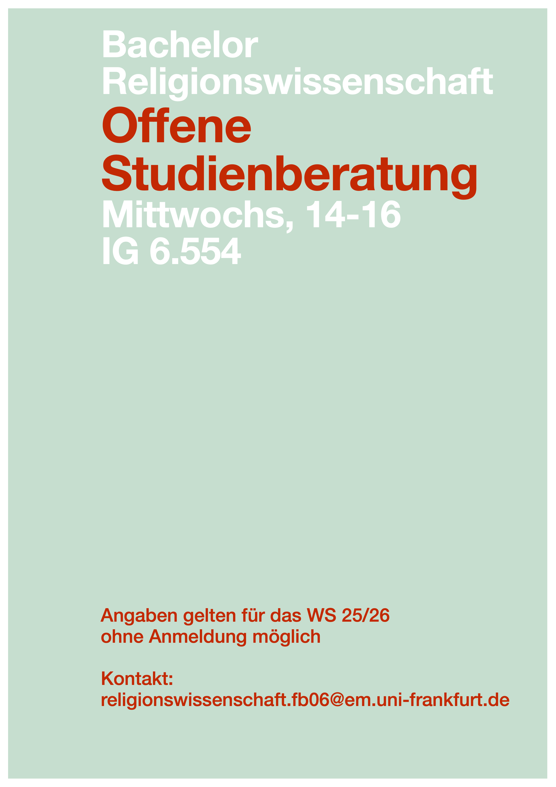

# Einführung in die 
### Religionswissenschaft
{: .r-fit-text}

### Welche Rolle spielen materielle Objekte in der Religion?

Wintersemester 2025/2026
Prof. Dr. Nathan Gibson

## Feedback

Hilfreich: 

- Reden von der Lehrende, Andere digitale Komponenten (Folien, Kurswebsite, Umfragen), Arbeit in Kleingruppen
- Abwechslung/interaktive Elemente, Erläuterungen durch den Dozenten, Austausch, Studierendenvideos, Folien

## Feedback

für manche Problematisch (viele haben "nichts" erwähnt):

- Lektüren, Videoprojekte von Studierenden, Arbeit in Kleingruppen
- z. T. englische Lektüren (x 3-4), Erstellung des Videoprojekts als Herausforderung (x 2), Zuordnung in Kleingruppen

## Infos

## 📈 Rückblick: Lernziel

Die mündliche und schriftliche Dynamik der abrahamitischen Religionen im Verhältnis zueinander zu beschreiben.

## 📈 Rückblick

- Die Kraft des geschrieben bzw. gesprochenen Wortes
- Offenbarung als Zentral in den "abrahamitischen" Religionen
- Schrift als Privileg, als Kraft und als (entwickelnde) Technologie

## 📈 Rückblick: Beispiel: Heilige Schriften im Judentum

Nicht nur Tanakh (die Bibel), sondern dessen Auslegung in mehrere Richtungen:

- durch Vokalisierung eines (zuerst) konsonantischen Textes
- durch Übersetzungen und Kommentare auf Aramäisch (Targum(im))
- durch mündliche Traditionen (mündliche Thora) in Mischna, Talmud und deren praktischen Folgen (Halakha)
- durch Predigten und Narrativen (Haggada)

## 📈 Rückblick: Beispiel: Heilige Schriften im Judentum



## 📈 Rückblick: Vergleich mit Christentum & Islam

- Apostolische Traditionen
- Quranrezitationen/Lesarten, Hadithe

## 📈 Rückblick: Zusammenfassung von Schriftlichkeit und Mündlichkeit

- Die Schriftlichkeit ist immer von der Mündlichkeit geprägt.
- Mündliche Traditionen werden oft durch schriftliche Traditionen stabilisiert.
- Die Schriftlichkeit hat in sich oft eine gewisse Flexibilität, mehrere Auslegungen zu erlauben.

## Einleitung

Mit welchen Sinnen erfährst du die Adventszeit? 

## Projekte

- Medallions von Messdiener/innen
- Ikonen und Reliquien 
- Rosenkranz

## Heutiges Lernziel

Erklären können, wie die Forschung an materiellen Objekten den Glauben an das Transzendente greifbar macht.

## Diskussion in Kleingruppen: Mitgebrachte Objekte

- Ob/warum dieses Objekt für dich heilig/sakral/besonders ist?
- Mit welchen Sinnen erfährst du es? 
- Welche Gefühle kommen für dich beim Verbrauch/Einsatz des Objekts ins Sinn? 
- Welche Normen gibt es über dieses Objekt? (z.B. Wer darf es benutzen? Wer darf es betasten?)

## Lektüre (Prohl): Materiale Religion als greifbar

S. 380

- nach dem "cultural turn" wird soziale Realität als "Folge von Kommunikationsprozessen" gesehen.
- Führt zu einem "diskursivem Religionsbegriff" (nicht vorab bestimmbar) wobei Prohl nur teilweise mitgeht: 
  > [Religion] als Set von Vorstellungen und Praktiken verstanden, mit denen das, was von den Akteuren als ,Transzendentes‘, ,Heiliges‘ oder ,außerhalb des säkularen menschlichen Einflussbereiches Stehendes‘ vorgestellt wird, für sie kognitiv und sinnlich erfahrbar und greifbar wird. (381)

## Lektüre (Prohl): Materiale Religion als greifbar

- ABER: "Transzendentes" usw. ist nicht empirisch zugänglich!
- DESWEGEN: Materielles als Vermittlung des Transzendentes (Brücke vom Menschlichen)

> Dem Ansatz der Materialen Religion geht es in einem sehr viel umfassenderen Sinn darum, zu erforschen, wie Religion sich auf materialer Ebene ereignet: Untersucht wird die Verkörperung von Religion durch Handlungen und Rituale als Ereignis, das aus spezifischen sozialen, habituellen und kognitiven Arrangements resultiert, die sich durch den Körper, den Raum sowie durch das Wechselspiel mit der materialen Welt vermitteln. (Prohl 379)

## Lektüre (Prohl): Materiale Religion als greifbar

<https://hyperchalk.studiumdigitale.uni-frankfurt.de/25rw-objekte/>

## Lektüre (Prohl): Materiale Religion als greifbar

Materiale Religion als Abkehr von (oder wenigstens Ergänzung zu) rein textbasierten (protestantisch-geprägten) Methoden.

## Lektüre (Prohl): Amida-Buddha Abdrücke

Diskussion in Kleingruppen (ab S. 385): Was wird durch diese Buddha-Abdrücke greifbar?



## Vorschau

Welche Rolle spielen heilige Orte in der Religion?