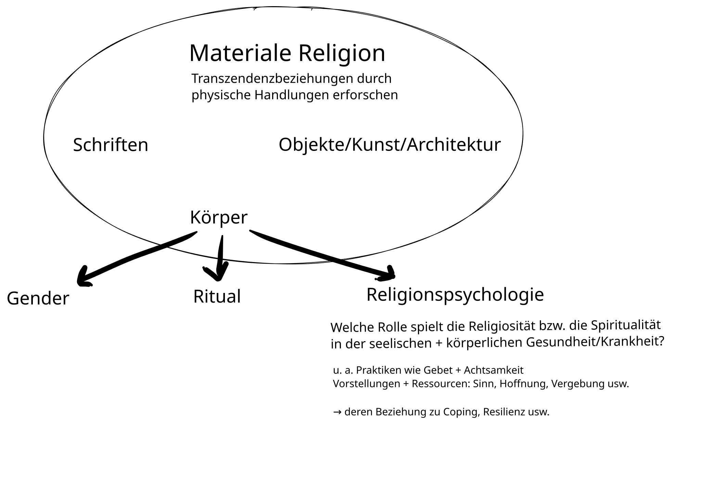
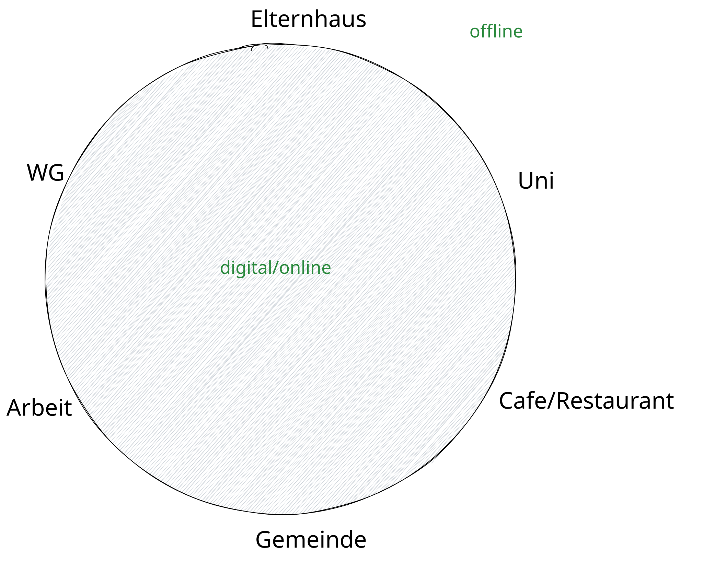

# Einführung in die 
### Religionswissenschaft
{: .r-fit-text}

### Wie wird Religion digital untersucht?

Wintersemester 2025/2026
Prof. Dr. Nathan Gibson

## 📈 Rückblick: Lernziel

Religionspsychologische Ansätze zur Krankheit und Heilung schildern.

## 📈 Rückblick: Religionspsychologie & Materiale Religion

<https://hyperchalk.studiumdigitale.uni-frankfurt.de/25rw11-koerper/>

 {: .r-stretch}

## 📈 Rückblick: Religionspsychologie in der Geschichte und heute

- große Figuren (u.a.): Sigmund Freud, William James
- Allport & co. (1950): extrinsisch religiös (sozialer Glaube) vs. intrinsisch religiös (innerer Glaube) > intrinsisch hat einen positiven Zusammenhang mit Gesundheit
- Heute wird nicht mehr von Religion als Psychose ausgegangen bzw. religiöse Fragen nicht mehr ausgegrenzt.

## 📈 Rückblick: Fallbeispiel: Studie zu Coping von Ladenhauf & Unterrainer

- Arten von Coping (Krankheitsverarbeitung): deferring (verschiebend), collaborative (zusammenarbeitend), self directive (selbstverantwortend)
- Forschungshypothese: "Resonanzraum" für spirituelle/religiöse Themen bietet bessere Behandlungsqualität
- Methode: Befragung von Patient/innen, quantitative Analyse
- Ergebnisse: manche Coping-Strategies haben einen signifikanten Zusammenhang mit spirituellen/religiösen Glauben (transzendent bzw. immanenten)

## 📈 Rückblick: Projekt

- Vipassana Meditation

## Einleitung

Spielen digitale Medien bei deiner (nicht-)Religiösität bzw. (nicht-)Spiritualität eine Rolle? 

## Heutiges Lernziel

Verständnis dafür zeigen, wie religiöse Identität, Gemeinschaft und Autorität in Online- und Offline-Umgebungen miteinander verwoben sind.

## Digitale Religionsforschung

#### Forschung (zu analogen Phänomenen) mit digitalen Werkzeugen

- Digitalisierung von Quellen, Analyse mit digitalen Werkzeugen, digitale Darstellung von Forschungsergebnissen

#### vs. Forschung zu digitalen Phänomenen ("Digital Religion")

- digitale Quellen + online-offline Dynamiken, evtl. auch digitale Analyse + Darstellung

## Chocolate Model für Forschung mit digitalen Werkzeugen

| {: height="300px" .fragment} | {: height="300px" .fragment} | {: height="300px" .fragment} | {: height="300px" .fragment} |
| **Pick** | **Prepare** | **Process** | **Package** |
| Collecting sources | Structuring data | Outputs | Presentation |
| Manuscripts, Photos, Interviews | Transcribing, Collating | Textual comparison, criticism, content analysis, coding | Edition, Narrative, Thematic discussion, Interactive website |

## Lektüre (Campbell & Evolvi)

4 Wellen: Digitale Religion als ... (6-7)
 
| 1. | 2. | 3. | 4. |
| --- | --- | --- | --- |
| neues Phänomen | Input für die religiöse Praxis und soziale Gemeinschaften | online und offline | tagtägliches Leben |
| Fokus auf Online-Users | Fokus auf Implikationen und Authentizität | Fokus auf Internet als im Leben gewoben | Sozialkritischer Fokus auf verbundene online und offline Umgebungen |

## Komisches Geräusch

Wer kennt dieses Geräusch?

<audio id="audio2" 
       preload="auto" 
       src="../assets/audio/dial-up.mp3#t=00:00:06" 
       oncanplaythrough="this.play();"
       controls>
</audio>

## Aktivität

In welchen Orten bist du jede Woche? Inwiefern bist du online oder offline auf dem Weg dorthin bzw. während du dort bist?

<https://hyperchalk.studiumdigitale.uni-frankfurt.de/25rw12-digital/>

 {: .r-stretch}

## Lektüre (Campbell & Evolvi)

### Theorien (theoretische Annahmen) (7-8)

  - mediation - Kommunikation passiert durch ein Medium (Objekt ggf. Technologie), wobei das Individuum und die Kultur wichtig sind. (S. Materiale Religion)
  - mediatization - Medien schaffen dauerhafte strukturelle Änderungen

## Lektüre (Campbell & Evolvi)

### Theorien (theoretische Annahmen) (7-8)

  - religious-social shaping of technology - Religiöse Gruppen gehen aktiv mit neuen Technologien um nach ihren Traditionen, Werten, Annahme/Ablehnung und Diskursen. (agency)
  - third spaces bzw. hypermediated spaces 
    - "Third Space" - neuer, hybrider Kontext, wo selbst die Logik und die Mittel, Bedeutungen zu schaffen, einzigartig sind.
    - Bestimmte religiöse "Räume" ermöglichen die Erschaffung von Netzwerken über mehrere virtuelle Plattformen und physische Orte.

## Lektüre (Campbell & Evolvi)

### Methoden (7)
  - "tripod" - Textanalyse (bzw. Medienanalyse), Interviews, Ethnographie
  - Unterschiede zwischen digitale Umgebungen, digitale Werkzeuge und theoretische Rahmen

## Lektüre (Campbell & Evolvi)

- Religiöse Identität (8)
    - "The Internet intensifies identity performances" 
    - Blogs als private/öffentliche Räume für die Erschaffung gemeinsamer Identitäten besonders für stigmatisierte Gruppen. Z.B. <http://www.muslimahmediawatch.org/about-2/>
    - Videospiele durch Avatars und Rituale

## Lektüre (Campbell & Evolvi)

- Religiöse Gemeinschaft (9)
  - Freundschaft und Beziehung neu definiert: inwieweit ist eine Internetgruppe eine Gemeinschaft mit gemeinsamen Werten?
  - Leute gehen in Online-Communities oft wenn sie mit Offline-Communities nicht zufrieden sind

## Lektüre (Campbell & Evolvi)
  
- Religiöse Autorität (11)
  - z.T. reproduzierte Autoritätsstrukturen (z.B. <https://twitter.com/Pontifex>)
  - z.T. neue Expert/innen (cf. Webers "Propheten", z.B. <https://www.instagram.com/missmayim/>)

## Zusammengefasst 

- "Digitale Religion" interessiert sich nicht nur für religiöse Aktivitäten online sondern für die Evolution religiöser Praktiken, die gleichzeitig zu Online- und Offline-Kontexten gebunden sind. (6)
  - wie traditionelle religiöse Praktiken an digitale Umgebungen angepasst werden
  - wie das Leben und die Gewohnheiten religiöser Gruppen von digitaler Kultur informiert werden

## Diskussion

- Lehramt: In welchen digitalen Räumen kommt Religion für Schulkinder heutzutage vor?
- Religionswissenschaft: Welche weitere Plattformen bzw. Praktiken würdest du untersuchen (außer die, die von Campbell und Evolvi erwähnt wurden)?

## Vorschau

Wie sollte religiöser Extremismus verstanden werden?