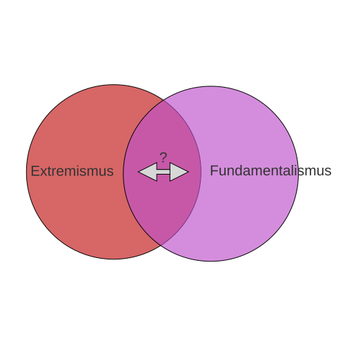
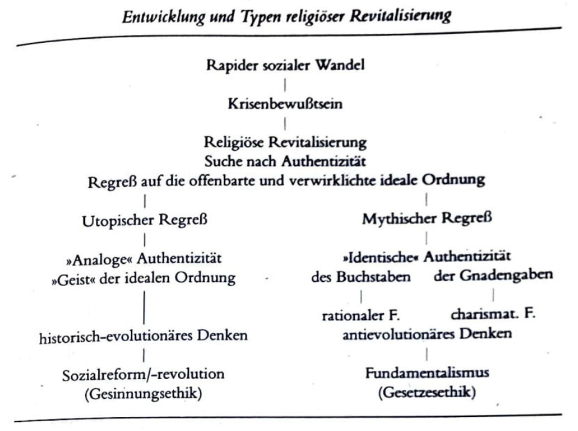
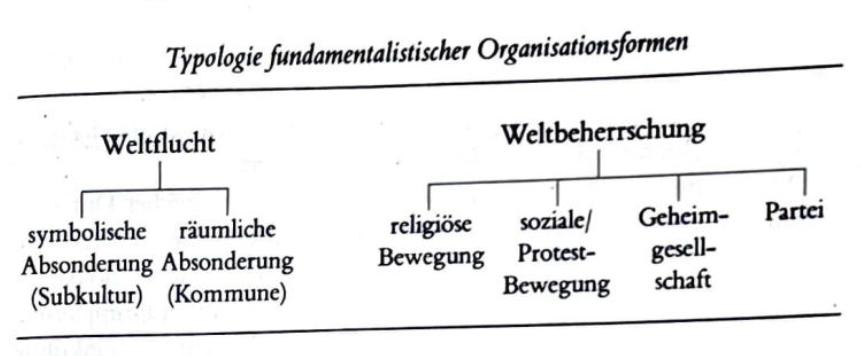

# Einführung in die 
### Religionswissenschaft
{: .r-fit-text}

### Wie sollten Fundamentalismus und religiöser Extremismus verstanden werden?

Wintersemester 2025/2026
Prof. Dr. Nathan Gibson

## 📈 Rückblick: Lernziel

Verständnis dafür zeigen, wie religiöse Identität, Gemeinschaft und Autorität in Online- und Offline-Umgebungen miteinander verwoben sind.

## 📈 Rückblick: Digitale Religionsforschung

Forschung (zu analogen Phänomenen) mit digitalen Werkzeugen vs. Forschung zu digitalen Phänomenen ("Digital Religion")

## 📈 Rückblick: Chocolate Model of Digital Research Processes

| {: height="300px" .fragment} | {: height="300px" .fragment} | {: height="300px" .fragment} | {: height="300px" .fragment} |
| **Pick** | **Prepare** | **Process** | **Package** |
| Collecting sources | Structuring data | Outputs | Presentation |
| Manuscripts, Photos, Interviews | Transcribing, Collating | Textual comparison, criticism, content analysis, coding | Edition, Narrative, Thematic discussion, Interactive website |

## 📈 Rückblick: Campbell & Evolvi

4 Wellen: Digitale Religion als ... (6-7)
 
| 1. | 2. | 3. | 4. |
| --- | --- | --- | --- |
| neues Phänomen | Input für die religiöse Praxis und soziale Gemeinschaften | online und offline | tagtägliches Leben |
| Fokus auf Online-Users | Fokus auf Implikationen und Authentizität | Fokus auf Internet als im Leben gewoben | Sozialkritischer Fokus auf verbundene online und offline Umgebungen |

## 📈 Rückblick: Theorien (theoretische Annahmen)

Was formt und was wird geformt, bzw. wo ist "Agency"? 

- Medien > mediation
- Strukturen? > mediatization
- Gruppen & Individuen? > religious-social shaping of technology
- Räumen? > third spaces (hybride Kontexte) und hypermediated spaces

## 📈 Rückblick: Identität, Gemeinschaft, Autorität

- Religiöse Identität (8): "The Internet intensifies identity performances" 
- Religiöse Gemeinschaft (9): Freundschaft und Beziehung neu definiert, Online- vs. Offline-Communities
- Religiöse Autorität (11): reproduzierte vs. neue Autoritätsstrukturen

## 📈 Rückblick: Digitale Religion

- "Digitale Religion" interessiert sich nicht nur für religiöse Aktivitäten online sondern für die Evolution religiöser Praktiken, die gleichzeitig zu Online- und Offline-Kontexten gebunden sind. (6)
  - wie traditionelle religiöse Praktiken an digitale Umgebungen angepasst werden
  - wie das Leben und die Gewohnheiten religiöser Gruppen von digitaler Kultur informiert werden

## Projekte

## Einleitung

- An welchen Gruppen denkst du, wenn du das Wort "fundamentalistisch" hörst?
- Wie würdest du dich fühlen, wenn jemand dich als "Fundamentalist/in" bezeichnet?

## Heutiges Lernziel

Fundamentalismus, Radikalisierung und Extremismus definieren und Beispiele für jeden Begriff geben.

## Lektüre: Riesebrodt

- Wie definiert Riesebrodt den Fundamentalismus?
- Warum vergleicht er am. Protestantismus (1920s) mit schiitischen Bewegungen in Iran (1970s)?

## Fundamentalismus vs. Extremismus vs. Radikalisierung

- Fundamentalismus: mobilisierter und radikalisierter Traditionalismus (19)
- Extremismus (im deutschen Kontext): "Ablehnung demokratischer wie auch rechtsstaatlicher Strukturen" (Khorchide 2015) (meistens mit Gewalt zu tun)
- Radikalisierung: Prozess der Entwicklung von extremistischen Ideologien und Überzeugungsstrukturen, der durch persönliche oder kollektive Ungerechtigkeitsempfindungen bzw. -erfahrungen in Gang gesetzt werden kann (Srowig et al. 1)

## Fundamentalismus vs. Extremismus vs. Radikalisierung

## Lektüre: Riesebrodt

Entwicklung

## Lektüre: Riesebrodt

Typologie 

## 5 ideologische Merkmale des Fundamentalismus

1. Reactivity to the Marginalized of Religion
1. Selectivity
1. Moral Manichaeism (good vs. evil)
1. Absolutism and Inerrancy and
1. Millenialism and Messianism

(Käsehage 2021, 83 nach Almond, Appleby, and Sivan 2003, 93, 90-115)

## 4 strukturelle Merkmale des Fundamentalismus

1. Elect, Chosen Membership
1. Sharp Boundaries
1. Authoritarian Organization and
1. Behavioural Requirements

(Käsehage 2021, 83 nach Almond, Appleby, and Sivan 2003, 93, 90-115)

## Extremismus und Radikalisierung

| Ebene | Dynamiken |
| --- | --- |
| Makroebene | z.B. Armut, systematische Diskriminierung, gesellschaftliche Änderungen |
| Meso-Ebene | z.B. Gruppenstrukturen, Angehörigkeit, Bindung ("in-group love" nach Sageman 2004 in Srowig et al) | 
| Mikro-Ebene | z.B. biographische Faktoren, Suche nach Bedeutung |

(vgl. Srowig et al.)

## Diskussion in Kleingruppen

- Ist eine Gruppe fundamentalistisch (nach welcher Art) oder extremistisch?

<https://hyperchalk.studiumdigitale.uni-frankfurt.de/25rw-extremismus/>

## Diskussion

Wie groß ist der überlappender Bereich?

## Lehrevaluation

<http://r.sd.uni-frankfurt.de/6d488853>

## Vorschau

Sollten Religionswissenschaftler/innen am interreligiösen Dialog mitwirken?